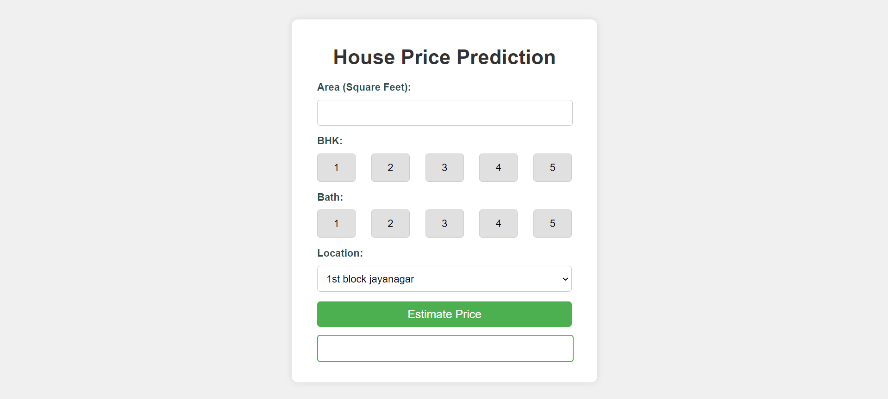
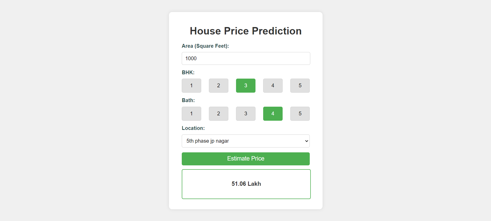

# Home Price Prediction

## Overview

This project aims to predict home prices using a machine learning regression model. The project is divided into multiple components, including the data preprocessing, model training, and deployment of a web application that allows users to input home features and get price predictions.

## Project Structure

- **client/**: Contains the frontend code that users interact with.
- **model/**: Includes the machine learning models used for predicting home prices.
- **server/**: Contains the backend code that handles API requests and serves the model.
- **Procfile**: Used for deploying the application on platforms like Heroku.
- **requirements.txt**: Lists the Python dependencies required for running the project.

## Setup Instructions

1. **Clone the repository**:

   ```bash
   git clone <repository_url>
   ```

2. **Navigate to the project directory**:

   ```bash
   cd Predict-house-pricing
   ```

3. **Install the required dependencies**:

   ```bash
   pip install -r requirements.txt
   ```

4. **Run the server**:

   ```bash
   python server/app.py
   ```

   This will start the backend server that serves the machine learning model.

5. **Run the client**:

   Depending on the setup, you might need to serve the frontend separately. If the client is a static site, you can serve it using a simple HTTP server:

   ```bash
   cd client
   python -m http.server
   ```

6. **Access the application**:

   Once both the server and client are running, you can access the application through your browser, typically at `http://localhost:5000` or another specified port.

## Model Details

The machine learning model used in this project is a regression model that predicts home prices based on various features like location, size, number of bedrooms, etc. The model was trained on a dataset containing historical home prices and their corresponding features.

## Deployment

The project is designed to be easily deployable on platforms like Heroku. The `Procfile` defines the commands that Heroku needs to run the application.

To deploy the project:

1. **Create a Heroku app**:

   ```bash
   heroku create your-app-name
   ```

2. **Push the code to Heroku**:

   ```bash
   git push heroku main
   ```

3. **Scale the web process**:

   ```bash
   heroku ps:scale web=1
   ```

4. **Open the application**:

   ```bash
   heroku open
   ```

## Example Screenshots

- 
- 

## License

This project is licensed under the MIT License. See the [LICENSE](LICENSE) file for more details.

## Acknowledgments

- Thanks to kaggle for providing the data used in this project.
- Inspiration and guidance from various online tutorials of Code basics.

---
